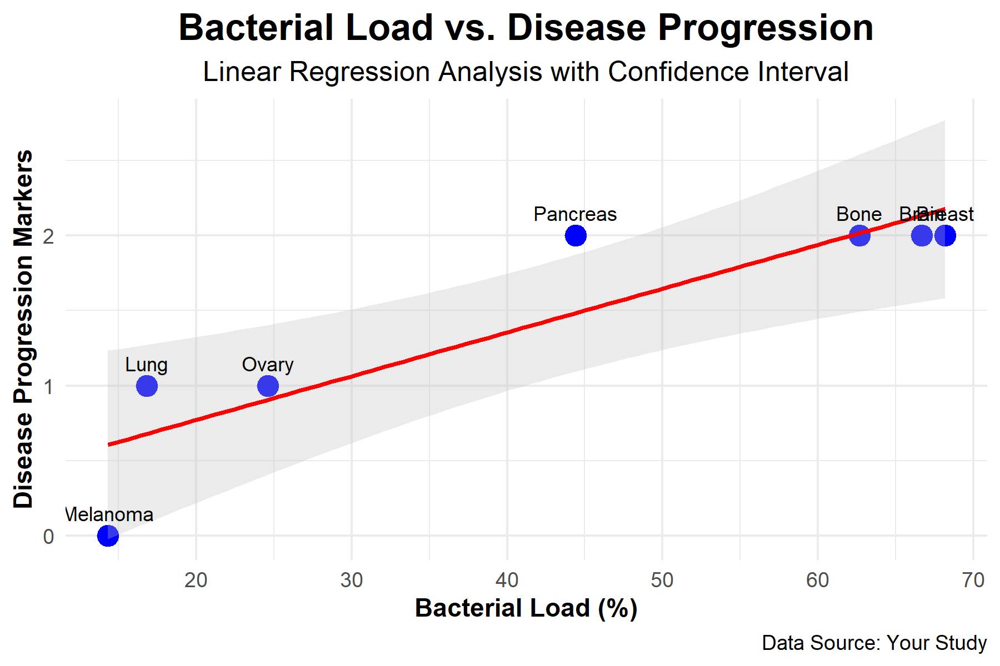

# 📊 Linear Regression Analysis: Bacterial Load vs. Disease Progression

This project uses R to perform a linear regression analysis exploring the relationship between **Bacterial Load** and **Disease Progression Markers** across different tumor types. It also visualizes the results using `ggplot2`.

## 📁 Files Included

- `regression_analysis.R` — Main R script for data loading, modeling, plotting, and saving results.
- `extracted_data.xlsx` — Excel file containing the dataset used in the analysis.
- `regression_results.txt` — Output file with the regression model summary.
- `regression_plot.png` — Saved plot visualizing the regression and data points.

## ▶️ How to Run
Clone or download this repository to your local machine.

Open regression_analysis.R in RStudio or your preferred R environment.

Make sure the Excel file extracted_data.xlsx is in the same folder, or update the file path in the script:
Run the script. It will:

-Load the data
-Fit a linear regression model
-Create and save a plot with confidence interval and labels
-Save the model summary to a text file

## 📈 Regression Output Summary

Call:
lm(formula = Disease_Progression_Markers ~ Bacterial_Load, data = data)

Residuals:
       1        2        3        4        5        6        7 
-0.17701  0.32153 -0.60558  0.09413  0.51687 -0.01666 -0.13328 

Coefficients:
               Estimate Std. Error t value Pr(>|t|)   
(Intercept)    0.188669   0.326386   0.578  0.58828   
Bacterial_Load 0.029155   0.006807   4.283  0.00784 **
---
Signif. codes:  0 '***' 0.001 '**' 0.01 '*' 0.05 '.' 0.1 ' ' 1

Residual standard error: 0.3989 on 5 degrees of freedom
Multiple R-squared:  0.7858,	Adjusted R-squared:  0.743 
F-statistic: 18.35 on 1 and 5 DF,  p-value: 0.00784

## 🧠 Interpretation
Bacterial Load is positively and significantly associated with Disease Progression Markers (p = 0.00784).

Approximately 78.6% of the variation in disease progression is explained by bacterial load.

The regression line shows a clear upward trend, indicating that higher bacterial loads may correspond to greater disease progression.

## 🖼️ Output Visualization
The saved plot (regression_plot.png) includes:
-Blue data points
-Red regression line with a gray confidence interval
-Tumor type labels above each point
-Clear titles and axis labels in a minimal theme

🧑‍💻 Author
Hamna Zahid
